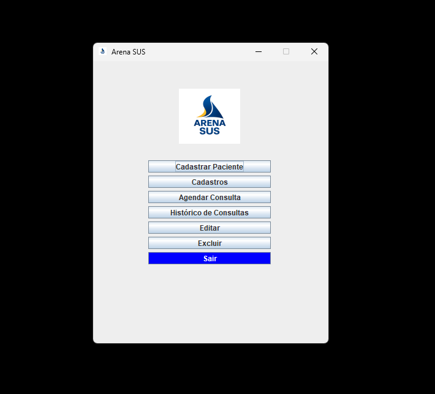
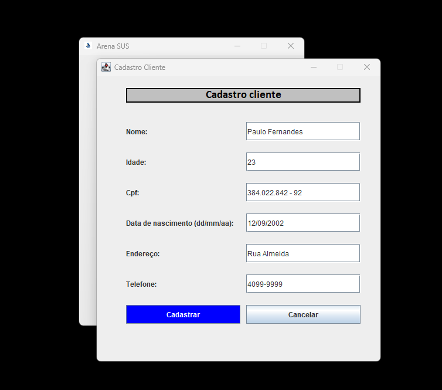
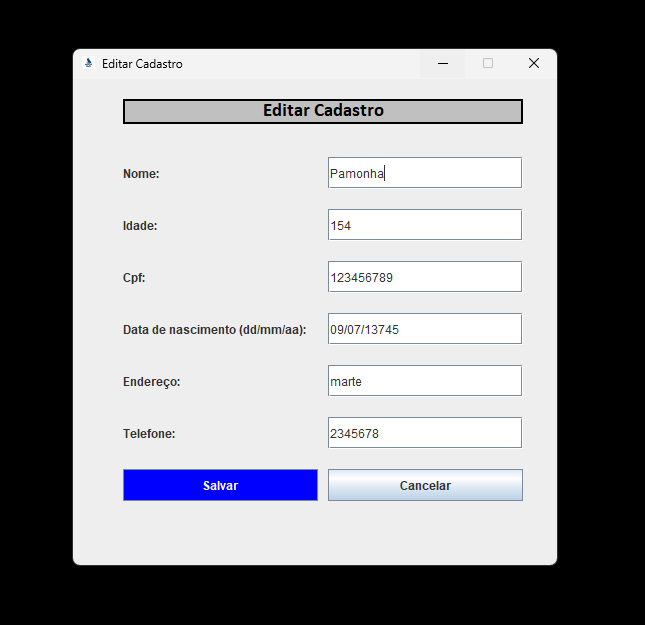
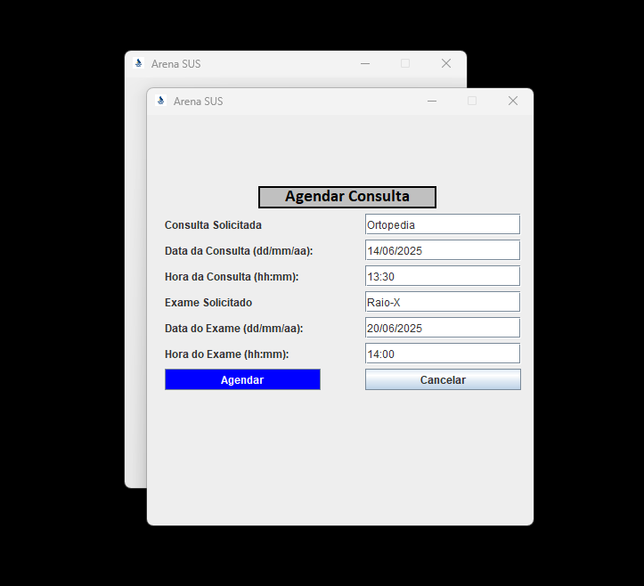
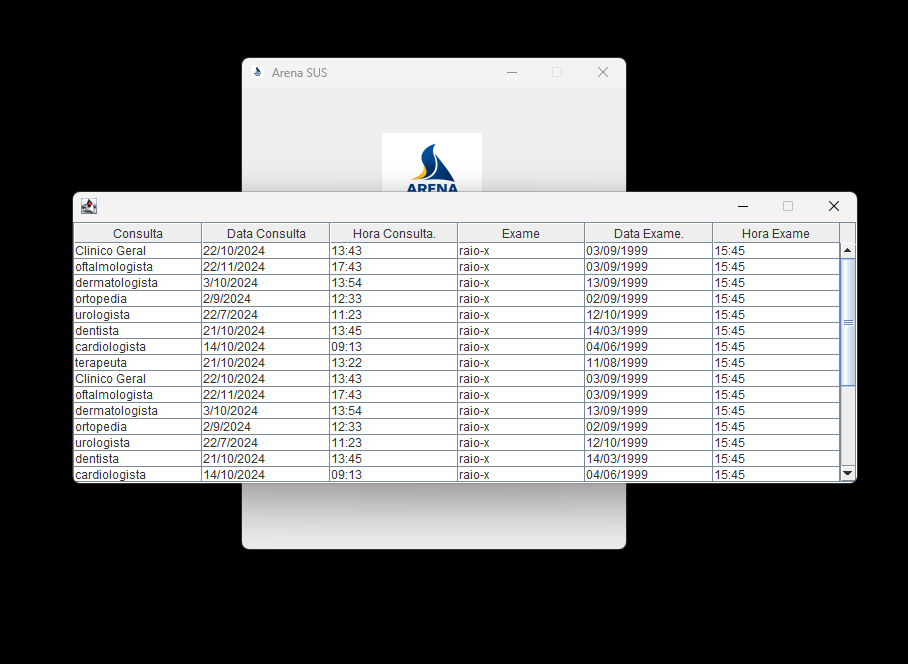
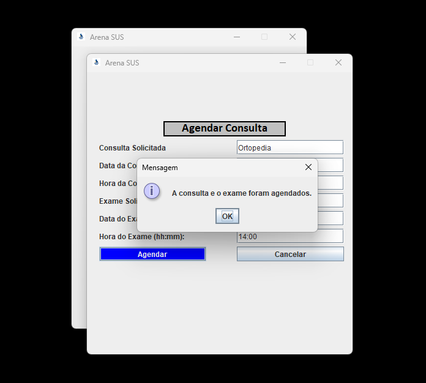
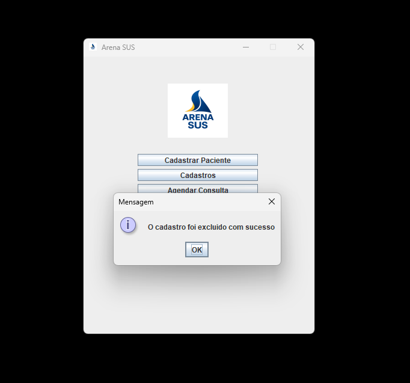
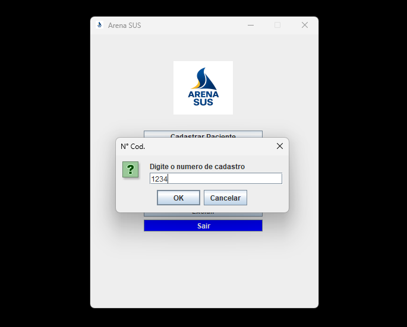
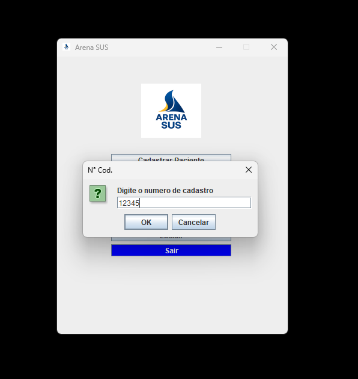
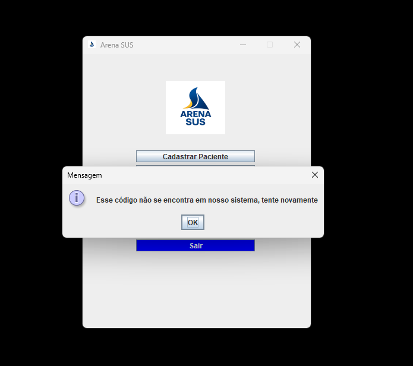

# 🖼️ Interface do Projeto Java

Este documento apresenta imagens ilustrativas da interface do sistema de gerenciamento médico desenvolvido em Java.

---

## 🏠 Tela Inicial



> Tela inicial do sistema com opções principais, como agendamento, histórico e edição de cadastro.

---

## 👤 Tela de Cadastro



> Formulário para o preenchimento de dados pessoais do paciente.

---

## ✏️ Tela de Edição de Cadastro



> Interface para editar informações previamente cadastradas do paciente.

---

## 📅 Tela de Agendamento



> Tela para agendar consultas ou exames, selecionando data, tipo e horário.

---

## 📜 Histórico de Consultas e Exames



> Exibe o histórico completo de exames e consultas agendadas ou realizadas.

---

## ✅ Tela de Confirmação de Agendamento



> Confirmação de que o agendamento foi realizado com sucesso.

---

## ❌ Tela de Cancelamento de Agendamento



> Mensagem indicando o sucesso no cancelamento de uma consulta ou exame.

---

## 🔍 Validação de Código



> Exemplo de código de verificação com 4 dígitos — inválido.



> Exemplo de código de verificação com 5 dígitos — válido.



> Tela exibindo o resultado de uma tentativa com código incorreto.

---

## 💡 Observações

- As imagens estão localizadas na pasta `imagens/` dentro do repositório.
- As interfaces são exibidas no terminal atualmente. Futuras versões podem incorporar uma interface gráfica com Swing ou JavaFX.

---

```
📌 Retorne ao README para mais informações sobre o projeto


